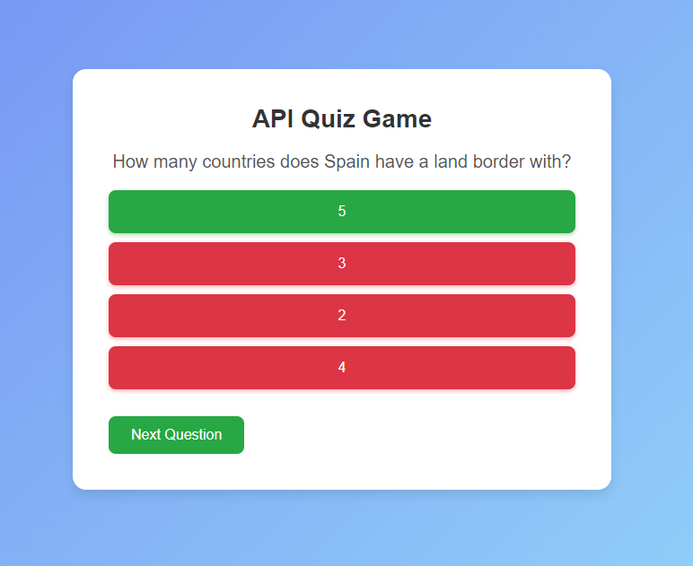

# API Quiz Game

This is a simple and interactive Quiz Game that pulls trivia questions from an API and presents them to the user in a fun, engaging, and responsive interface. The project demonstrates the use of external API data, dynamic user interface updates, and basic game mechanics to create a seamless user experience.

## Features

- Fetches trivia questions in real-time from an external API.
- User-friendly interface with a score-tracking system.
- Responsive design that works on desktop and mobile devices.
- Multiple question categories and difficulty levels to choose from.
- Immediate feedback on correct and incorrect answers.
- Lightweight and fast performance.

## Technologies Used

- HTML5
- CSS3
- JavaScript (Vanilla JS)
- Trivia API (Open Trivia DB)

## Screenshots



## Getting Started

### Prerequisites

Before you begin, ensure you have met the following requirements:

- You have a modern web browser that supports JavaScript.
- You have internet access to fetch questions from the API.

### Installing

1. Clone the repository:

    ```bash
    git clone https://github.com/your-username/api-quiz-game.git
    ```

2. Navigate to the project directory:

    ```bash
    cd api-quiz-game
    ```

3. Open the `index.html` file in your preferred web browser:

    ```bash
    open index.html
    ```

### Usage

Once you've opened the project in your browser, you can start playing by selecting a category and difficulty level for your quiz. Answer the questions as they appear, and see how well you score!

### API Reference

This game uses the [Open Trivia Database API](https://opentdb.com/api_config.php) to fetch trivia questions.

- **Endpoint**: `https://opentdb.com/api.php`
- **Parameters**:
  - `amount`: Number of questions
  - `category`: Category of questions
  - `difficulty`: Difficulty level (easy, medium, hard)

Example API call:

```bash
https://opentdb.com/api.php?amount=10&category=9&difficulty=medium
